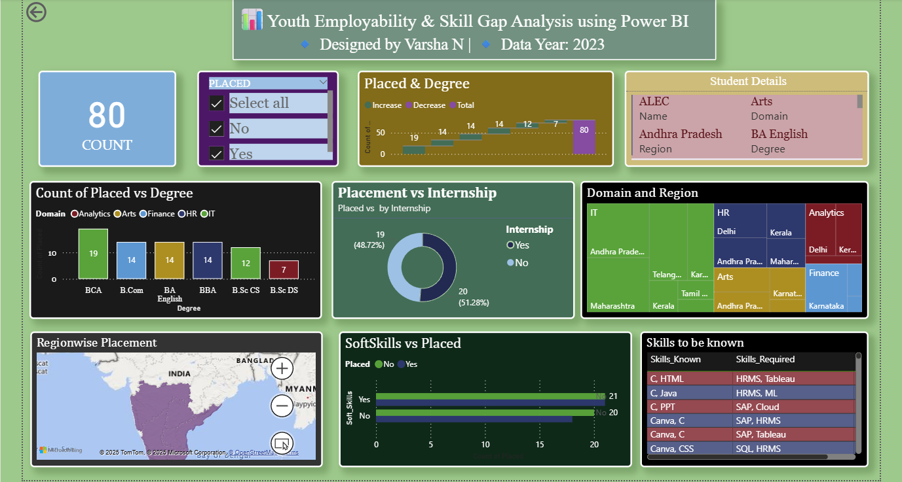

# Youth Skill Gap & Employability Analysis in India 🎓💼

## 📊 Project Overview
This Power BI project explores the **youth skill gap** and **employability trends** in India.  
It highlights how skill mismatches affect job readiness, employment rate, and regional trends.  
The dashboard provides visual insights into education levels, gender distribution, and skill-based employability rates.

---

## 🧩 Dataset Information
The dataset contains:
- **Region:** State or zone information  
- **Skill Level:** Categorized as low, medium, or high  
- **Employment Rate:** Percentage of employable youth  
- **Education Stream:** Field of study  
- **Gender:** Male/Female distribution  

🗂️ *File:* [Youth_Skill_Gap_Data.xlsx](Youth_Skill_Gap_Data.xlsx) *(Download and extract the dataset before use)*

---

## 💡 Key Insights
- 📈 Employment rate varies significantly across states  
- 🧠 Skill gaps are higher in certain education streams  
- 👩‍🎓 Female employability ratio is improving in Tier 2 cities  
- 🕹️ Skill-based training programs show better outcomes  

---

## 🛠️ Tools & Technologies
- Power BI  
- Data Cleaning & Transformation  
- DAX for Calculations  
- Microsoft Excel / CSV  
- Data Visualization Techniques  

---

## 📸 Dashboard Preview

---

## 📂 Power BI File
📥 *Download the dashboard file:*  
[Youth_Skill_Gap.pbix](Youth_Skill_Gap.pbix)  

---

## 🚀 Future Enhancements
- Add dynamic filters for region-wise comparisons  
- Include real-time data updates using APIs  
- Create storytelling dashboard view for presentation  

---

## 👩‍💻 Developed by
**Varsha N**  
🎓 B.Sc. Computer Science with Data Analytics | Kongunadu Arts and Science College  
📍 Coimbatore, India  

🔗 **Links:**  
[🌐 LinkedIn](https://www.linkedin.com/in/varshanagarajan06/) | [💻 GitHub](https://github.com/varsha-N-06)

---

> 📢 **Note:** Some files (like `.pbix`) can’t open directly in GitHub.  
> To view them, click **“View raw”** to do
